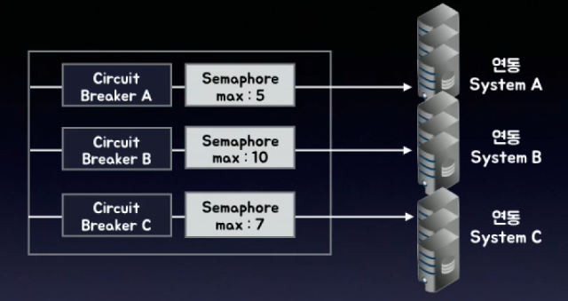

# Spring cloud 기반 MSA 전환

>> Deep Dive into Hystrix, Ribborn, Eureka

## 1. Hystrix
> Netflix 에서 만든 Fault Tolerance Library
- 장애 전파 방지 & Resilience

### *기능적 관점에서 본 Hystrix의 주요 4가지 기능*
- Circuit Breaker
- Fallback
- Thread Isolation
- Timeout

### *Hystrix Command 호출 시 벌어지는 일*
1. 이 메소드를 intercept 하여 대신 실행한다.
    - Thread Isolation
2. 메소드의 실행 결과 성공 혹은 실패(Exception) 발생 여부를 기록하고 통계를 낸다. 통계에 따라 Circuit Open 여부를 결정한다.
3. 실패한 경우(Exception) 사용자가 제공한 메소드를 대신 실행한다.
    - Fallback
4. 특정 시간 동안 메소드가 종료되지 않는 경우 Exception 발생
    - Timeout

### *Hystrix - Circuit Breaker*
- ***(1) 일정시간*** 동안 ***(2) 일정 개수 이상의 호출***이 발생한 경우,   
***(3) 일정 비율 이상의 에러*** 가 발생하면 --> **Circuit Open(호출차단)**
- ***(4)일정 시간 경과*** 후에 단 한개의 요청에 대해서 호출을 허용하며 (Half Open),   
이 호출이 성공하면 --> **Circuit Close(호출허용)**

### *Hystrix - Fallback*
- Fallback 으로 지정된 메소드는 다음의 경우에 원본 메소드 대신 실행된다.
    * Circuit Open
    * Any Exception (HystrixBadRequestException 제외)
        + HystrixBadRequestException
            + 호출자가 잘못 호출할 시(IllegalArgumentException, IllegalStateException 등)   
            HystrixBadRequestException로 wrapping 하여 Throw 하도록 작성해야 한다.
            + 사용자의 코드에서 HystrixBadRequestException 을 발생시키면,   
            이 오류는 Fallback 을 실행하지 않으며, Circuit Open 을 위한 통계에도 집계되지 않는다. 
            + 사용자(Method Caller) 오류이기 때문에 서버 오류로 간주하지 않는다.
    * Semaphore / ThreadPool Rejection (Isolation 과 관련)
    * Timeout
- 단, 잘 못 설정할 시 예외 발생으로 인해 비즈니스 로직이 실행되지 않고 Fallback 으로 대체되어 **발생해야 할 오류가 감춰지는 사태**가 벌어질 수 있다.

### *Hystrix - Timeout*
- Hystrix 에서는 Circuit Breaker 단위로 (CommandKey 단위로) Timeout을 설정할 수 있다.
    ``` yaml
        hystrix.command.<commandkey>.exception.isolation.thread.timeoutInMilliseconds - default 1초
    ```
- Circuit Breaker 의 Timeout 사용시 주의 사항
    * Semaphore Isolation 인 경우 - 제시간에 Timeout 이 발생하지 않는 경우가 대부분이다.
    * Default 값이 매우 짧다 - 1초
        + 따라서 복잡하고 시간이 소요되는 API 호출의 경우 이보다 높게 설정해야 Timeout 이 적용된다.

### *Hystrix - Isolation*
- 두 가지 Isolation 방식을 Circuit Breaker 별로 지정 가능
    * Semaphore Isolation

        
        + Circuit Breaker 1개당 1개의 Semaphore 생성
        + Semephore 별로 최대 동시 요청 개수 지정
        + 최대 개수 호출 초과시 Semaphore Rejection 발생 - Fallback 실행
        + Command를 호출한 **Caller Thread** 에서 메소드 실행
            + *Caller Thread 와 실제 메소드가 실행되는 Thread 가 같다.*
        + *주의 : Timeout이 제 시간에 발생하지 못함*
            + 자바는 태생적으로 InterruptedException 을 제외하면 이미 돌고 있는 Thread 를 강제로 멈출 방법이 없다.   
            따라서 Timeout 이 지나도 이미 Thread 가 돌고 있다면 caller Thread 가 리턴되지 않는다.
    * Thread Isolation (Default)
        
        
        + Circuit Breaker 별로 사용할 Thread Pool을 지정 (ThreadPoolKey)   
        + Circuit Breaker : Thread Pool = N:1 관계 가능
        + 최대 호출 개수 초과시 Thread Pool Rejection 발생 - Fallback 실행
        + Command를 호출한 Caller Thread 가 아닌 Thread Pool 에서 메소드 실행
            + *Caller Thread 와 실제 메소드가 실행되는 Thread 가 다르다.*
            + Timeout 이 지나면 Caller Thread 가 바로 리턴된다.
        + *실제 메소드의 실행은 다른 Thread 에서 실행되므로 Thread Local 사용 시 주의 필요*
            + 많은 라이브러리들이 Thread Local을 의존하는 경우가 많다
            + Thread 가 변경되면 Thread Local 이 망가질 수 있으니 주의 해야한다.

## 2. Ribbon
> Netflix가 만든 Software Load Balancer를 내장한 RPC(REST) Library
- Client Load Balancer with HTTP Client
- 기존의 하드웨어 적으로 처리하던 로드밸런싱과 다르다

### *Ribbon in Spring Cloud*
- Spring Cloud 에서는 Ribbon 클라이언트를 사용자가 직접 사용하지 않음 
    * 옵션이나 설정으로만 접하게됨 - 직접 Ribbon 클라이언트를 호출하지 않음
- Spring Cloud의 HTTP 통신이 필요한 요소에 내장되어 있음
    * Zuul API Gateway
        + Ribbon이 내장되어 L4의 도움없이 수 백대의 서버의 Load Balancing 을 수행할 수 있다
    * RestTemplate (@LoadBalanced)
        + SpringBoot 어플리케이션이 Spring Cloud가 enable 되어있다면,   
        RestTemplate 이 빈으로 설정되어 있는 경우에 @LoadBalanced 어노테이션을 붙이면,   
        이 RestTemplate 의 Intercepter를 통해서 Load Balancer 를추가하게 된다.
            + Ip 주소와 Port 번호를 넣지않고 호출할 서버군의 이름을 적으면   
            그 군에 해당하는 서버 목록을 LoadBalancer 가 알아서 호출한다.
    * Spring Cloud Feign - 선언적 Http Client

### *Ribbon 이 기존 Load Balancer 와 다른 점*
- Ribbon 은 대부분의 동작이 Programming 가능함
- Spring Cloud 에서는 아래와 같은 BeanType (인터페이스) 으로Ribbon Client 마다 Ribbon 의 모든 동작들을 코딩으로 넣을 수 있다.
    * IRule : 주어진 서버 목록에서 어떤 서버를 선택할 것인가
    * IPing : 각 서버가 살아있는 가를 검사
    * ServerList<Server> : 대상 서버 목록 제공
    * ServerListFilter<Server> : 대상 서버들 중 호출할 대상 Filter
    * ServerListUpdator
    * IClientConfig
    * ILoadBalancer

## 3. Eureka
> Netflix 가 만든 Dynamic Service Discovery
- 등록 : 서버가 자신의 서비스 이름(종류)와 IP 주소, 포트를 등록
- 조회 : 서비스 이름(종류)을 갖고 서버 목록을 조회
- DNS 기반이 아니라 Eureka 서버에 등록함으로써 다른 곳에서목록을 가져올 수 있도록 한다
- Ribbon 이 서버목록을 가져오는데 사용된다
+ 

### *Eureka in Spring Cloud*
- Eureka 가 Enable 된 Spring Cloud Application 은
    * Server 시작 시 Eureka 서버에 자동으로 자신의 상태 등록 (UP)
        + 서버가 살아있는지 여부 및 어떤 도메인의 정보를 제공하는 서버인지 서버군 이름을 등록
    * 주기적으로 HeartBeat 으로 Eureka Server 에 자신이 살아있음을 알림
    * Server 종료 시 Eureka 서버에 자신의 상태 변경 (DOWN) 혹은 자신의 목록 삭제
    * Eureka 상에 등록된 이름은 아래 설정에 정해준 이름이다
        ``` yaml
        spring.application.name
        ```

### *Eureka + Ribbon in Spring Cloud*
- 하나의 서버에 Eureka Client 와 Ribbon Client 가 함께 설정되면 Spring Cloud 는 다음의 Ribbon Bean 을 대체한다
1. ServerList<Server>
    - 기본 : ConfigurationBasedServerList
    - 변경 : DiscoveryEnableNIWSServerList
        * 원래 application.yml or properties 에서 서버 목록을 직접 지정해 줬던 것들이 Eureka 를 통해서 Look Up 해오는 모듈로 변경
2. IPing 
    - 기본 : DummyPing
    - 변경 : NIWSDiscoveryPing
        * 아무것도 안 하던 Ping 도 Eureka 에 아직 등록 되어있는지 지속적으로 확인하는 Ping 으로 변경된다
- 서버의 목록을 설정(yml, properties)으로 명시하는 대신 Eureka 를 통해서 Look Up 해오는 구현
- 기존 Ribbon 입장에서는 Eureka 가 없다면 설정 기반의 로드 밸런싱을 하지만 Eureka 가 있다면 Eureka 가 알아서 로드 밸런싱을 한다

## 중요한 개념

### API Gateway
- MSA 환경에서 API Gateway의 필요성
    * Single Endpoint 제공
        + API를 사용할 Client 들은 API Gateway 주소만 인지
    * API 의 공통 로직 구현
        + Logging, Authentication, Authorization
    * Traffic Control
        + API Quota, Throttling